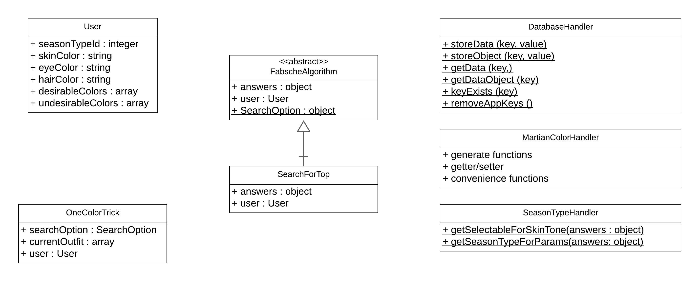

# dressMeUp
___
_DressMeUp_ ist eine mobile Applikation, welche ein Werkzeug für die Unterstützung des Anwenders bei der 
Zusammenstellung farblich passender Kleidung darstellt. Sie wird verwendet, um Entscheidungen der farblichen 
Komposition zu erleichtern und das Auge des Benutzer darin zu schulen, Farbharmonien und Disharmonien zu 
identifizieren.

Anwender können nach einen Kleidungsstück, zum Beispiel einen T-Shirt oder einer Jacke suchen und bekommen am Ende eine 
Menge an passenden Farben dargestellt. Präferenzen und das äußerliche Erscheinungsbild des Anwenders sollen hierbei 
berücksichtigt werden, um die Ergebnismenge zu sortieren. Die Gewichtung der Sortierparameter soll möglichst real sein.

Das Projekt ist innerhalb meiner Bachelorarbeit entstanden und ist öffentlich zugänglich im Google Play Store

---

## Klassenhierarchie


## Projektstruktur
```
dressMeUp   
│   App.js
│   ...
│
└───FabscheAlgorithmus
│   │
│   └───frameworks
│   │   │
│   │   └───TinyColor
│   │   │   │   ...
│   │   │
│   └───src
│   │   └───resources
│   │   │   │   martianColorWheelData.js
│   │   │   │   seasonTypeData.js
│   │   │   
│   │   └───scripts
│   │   │   │   FabscheAlgorithm.js
│   │   │   │   Helpertool.js
│   │   │   │   LoggingTool.js
│   │   │   │   MartianColorHandler.js
│   │   │   │   OneColorTrick.js
│   │   │   │   SearchForTop.js
│   │   │   │   User.js
│
└───src
    └───resources
    │   │ 
    │   └───data
    │   │   │   ...
    │   │ 
    │   └───images
    │       │   ...
    │   
    └───scripts
    │   │ 
    │   └───components
    │   │   │   AnimatedCircle.js
    │   │   │   MartianColorSelect.js
    │   │   │   QuestionHandler.js
    │   │ 
    │   └───js
    │   │   │   ColorHandler.js
    │   │   │   DatabaseHandler.js
    │   │   │   GlobalStyle.js
    │   │   │   NavigationHandler.js
    │   │   │   RootNavigation.js
    │   │   │   SeasonTypeHandler.js
    │   │ 
    │   └───views
    │   │   │   CreateUserView.js
    │   │   │   SearchView.js
...
```

### User.js
Objekte der Klasse User halten die repräsentativen Nutzerdaten. Sie beinhalten die äußerlichen Merkmale des Benutzers, 
die präferierten und nicht präferierten Farben als auch den Typ des Anwenders

**Projektpfad:** [FabscheAlgorithmus/src/scripts/User.js](FabscheAlgorithmus/src/scripts/User.js)

### OneColorTrick.js
Der One-Color-Trick ist eine etablierte Methode in der Zusammenstellung von Kleidung, welche auf der Kombination von 
nicht neutralen- und neutralen Farben basiert. In der Theorie lassen sich ohne große Bedenken neutrale Farbe miteinander
kombinieren. Besteht das zusammengestellte Outfit ausschließlich aus neutralen Farben, so kann dazu eine beliebige Farbe
getragen werden. Ist die farbliche Zusammenstellung des Outfits wiederum eine Kombination aus neutralen Farben und 
maximal einer nicht neutralen Farbe, so kann eine Farbe der gleichen Farbfamilie gewählt werden.

**Projektpfad:** [FabscheAlgorithmus/src/scripts/OneColorTrick.js](FabscheAlgorithmus/src/scripts/OneColorTrick.js)

### DataBaseHandler.js
Die Klasse DatabaseHandler ist die Schnittstelle für das Arbeiten mit dem Framework AsyncStorage. Es besitzt 
Hilfsfunktionen, um Daten beziehungsweise Datenobjekte zu speichern und auszulesen. Des weiteren können Datensätze auf 
ihre Existenz überprüft werden und gegebenenfalls gelöscht werden.

**Projektpfad:** [src/scripts/js/DatabaseHandler.js](src/scripts/js/DatabaseHandler.js)

### MartianColorHandler.js
Der MartianColorHandler dient grundlegend dazu, um mit den eingespeisten Farbobjekten zu arbeiten. Essentielle Funktion 
ist findColorByProperty, welche die Farbe anhand des übergebenen property- und value Parameters zurückgibt. Zusätzlich 
können durch die Hilfsfunktionen isDarkColor und isLightColor die Farben nach ihrer Helligkeit unterschieden werden. 
Des weiteren gibt es Funktionen, um die warmen- und kalten Farben zu identifizieren, Farben anhand ihrer Bezeichnung zu 
filtern, den Farbwert, die Sättigung oder die Helligkeit der Farbe zu extrahieren und Farbobjekte zu vergleichen. 
Hauptaufgabe der Klasse ist die Implementierung der Farbschemata.

**Projektpfad:** [FabscheAlgorithmus/src/scripts/MartianColorHandler.js](FabscheAlgorithmus/src/scripts/MartianColorHandler.js)

### SeasonTypeHandler.js
Im Rahmen der Identifizierung des Typs werden dem Anwender Fragen zu äußerlichen Merkmalen und Präferenzen gestellt. 
Der SeasonTypeHandler ermittelt anhand der gegebenen Daten den Typ des Anwenders. Grundlage ist der von Zalando 
implementierte Algorithmus, welcher auf der Theorie des Vier-Farbtyp-Systems basiert.

**Projektpfad:** [src/scripts/js/SeasonTypeHandler.js](src/scripts/js/SeasonTypeHandler.js)

### FabscheAlgorithm.js
Allgemeingültige Vorgaben und Verhaltensweisen sind innerhalb der Realisierung festgeschrieben. 
Diese Klasse ist eine Blaupause für erbende Klassen, die einen Suchalgorithmus für Kleidungsstücke anhand der 
Business-Idee FabscheAlgorithmus realisieren (vgl. SearchForTop.js).

**Projektpfad:** [FabscheAlgorithmus/src/scripts/FabscheAlgorithm.js](FabscheAlgorithmus/src/scripts/FabscheAlgorithm.js)

### SearchForTop.js
Die Klasse realisiert den Prozess für das Suchen nach einem farblich passenden Oberteil.

**Projektpfad:** [FabscheAlgorithmus/src/scripts/FabscheAlgorithm.js](FabscheAlgorithmus/src/scripts/SearchForTop.js)
_ _ _

### _Mobile Applikation_


### dressMeUp/App.js
Beinhaltet die Definition der einzelnen Views und deren Einordnung in der StackNavigation. 

**Projektpfad:** [dressMeUp\App.js](App.js)

---
### dressMeUp/src/resources/data
In dem Pfad befinden sich essentielle Daten für das Arbeiten mit der Applikation.

**Projektpfad:** dressMeUp\src\resources\data

---
### dressMeUp/src/resources/image
In dem Pfad befinden sich die Bilder, welche in der mobilen Applikation benutzt werden. Bitte beachten Sie die README.md.

**Projektpfad:** dressMeUp\src\resources\images

---

### dressMeUp/src/scripts/components

### AnimatedCircle.js
Die Klasse beinhaltet den Quellcode für den animierten Kreis, welcher auf dem Startbildschirm zu sehen ist.

### MartianColorSelect.js
Die Klasse beinhaltet die generischen Views für die Selektion einer Farbe. Die beinhalteten Komponenten werden für jede 
View benutzt, welche den Anwender bittet eine Farbe auszuwählen.

### QuestionHandler.js
Der QuestionHandler ist eine generische Lösung für das Darstellen von Fragen. Bei der Integration muss lediglich ein Array
aus Frage-Objekten übergeben werden (vgl. dressMeUp/scripts/views/CreateUserView). 

_Version 1.0 beinhaltet folgende Fragetypen:_
- STANDARD
- STANDARD_DYNAMIC
- SELECT_SEASON_TYPE
- SELECT_SKIN_TONE:
- MULTI_SELECT:

```javascript
const questions = [
    { id: "0", title: 'Möchtest du auffallen?', type: 'STANDARD_DYNAMIC', options: [{"key": "Ja", "value": false}, {"key": "Nein", "value": true}], storeAs: "wantToStandOut"},
    { id: "1", title: 'Möchtest du deine Augen hervorstechen lassen?', type: 'STANDARD_DYNAMIC', options: [{"key": "Ja", "value": false}, {"key": "Nein", "value": true}, {"key": "Mir egal", "value": null}], storeAs: "focusEyeColor"},
    { id: "2", title: 'Gesättige- oder Grelle Farben?', type: 'STANDARD_DYNAMIC', options: [{"key": "Gesättigte Farben", "value": true}, {"key": "Grelle Farben", "value": false}, {"key": "Mir egal", "value": null}], storeAs: "preferSaturatedColors", isConditional: true},
    { id: "3", title: 'Magst du eher helle- oder dunkle Farben?', type: 'STANDARD_DYNAMIC', options: [{"key": "Helle Farben", "value": false}, {"key": "Dunkle Farben", "value": true}, {"key": "Mir egal", "value": null}], storeAs: "preferLightColors", skipWhen: [true, false]},
    { id: "4", title: 'Welche Farbe haben deine Schuhe?', type: 'MARTIAN_COLOR', storeAs: "shoes"},
    { id: "5", title: 'Welche Farbe hat deine Hose?', type: 'MARTIAN_COLOR', storeAs: "trousers"},
    { id: "6", title: 'Trägst du eine Jacke?', type: 'STANDARD_DYNAMIC', options: [{"key": "Ja", "value": true}, {"key": "Nein", "value": false}], isConditional: true},
    { id: "7", title: 'Welche Farbe hat deine Jacke?', type: 'MARTIAN_COLOR', storeAs: "jacket", skipWhen: false},
];
```
---
### dressMeUp/src/scripts/js

### DataBaseHandsler.js
[vgl. DataBaseHandler.js](#databasehandler.js)

### GlobalStyle.js
Die Klasse beinhaltet allgemeingültige Style-Informationen für UI-Komponenten.

**Projektpfad:** [dressMeUp\src\scripts\js\GlobalStyle.js](src/scripts/js/GlobalStyle.js)

### RootNavigation.js
Die Klasse bereitet das Arbeiten mit der StackNavigation vor. Es beinhaltet eine Hilfsfunktion, welche das Navigieren 
zwischen den verschiedenen Views des Stacks erleichtert.

**Projektpfad:** [dressMeUp\src\scripts\js\RootNavigation.js](src/scripts/js/RootNavigation.js)

### SeasonTypeHandler.js
Im Rahmen der Identifizierung des Typs werden dem Anwender Fragen zu äußerlichen Merkmalen und Präferenzen gestellt.
Der SeasonTypeHandler ermittelt anhand der gegebenen Daten den Typ des Anwenders. Grundlage ist der von Zalando
implementierte Algorithmus, welcher auf der Theorie des Vier-Farbtyp-Systems basiert.

**Projektpfad:** [dressMeUp\src\scripts\js\SeasonTypeHandler.js](src/scripts/js/SeasonTypeHandler.js)

---
### dressMeUp/src/scripts/views

### CreateUserView.js
Die Klasse beinhaltet Logik und Aussehen der View für das Erstellen des Anwenderprofils.

**Projektpfad:** [dressMeUp\src\scripts\js\CreateUserView.js](src/scripts/js/CreateUserView.js)

### SearchView.js
Die Klasse beinhaltet Logik und Aussehen für die Suche nach der ausgewählten Kleidung. In Version 1.0 ist die Suche nach
einem passenden Oberteil implementiert.

**Projektpfad:** [dressMeUp\src\scripts\js\SearchView.js](src/scripts/js/SearchView.js)

---
## Frameworks
### TinyColor
_TinyColor_ ist es eine ressourcenarme JavaScript-Bibliothek für das Arbeiten mit Farben. Innerhalb des Algorithmus wird
es benutzt, um farbspezifische Hilfsfunktionen und Farbkonvertierungen auszuführen.

**Link**: [https://github.com/bgrins/TinyColor](https://github.com/bgrins/TinyColor)

**Projektpfad**: [dressMeUp\FabscheAlgorithmus\frameworks\TinyColor](FabscheAlgorithmus/frameworks/TinyColor/tinycolor.js)

---
## Danksagung

Im folgenden Abschnitt möchte ich mir für die Unterstützung der folglich genannten Personen bedanken. Sie haben mich während
der Erarbeitung der Bachelorarbeit sowie beim Testen der Anwendung unterstützt.

T. Stark, M.Heyer, T. Ostermaier, S. Weigel, M. Frank, D. Weigel, E. Felski, C. Ebel, U. Ebel, S. Ebel, D. Albrecht, 
S. Albrecht

